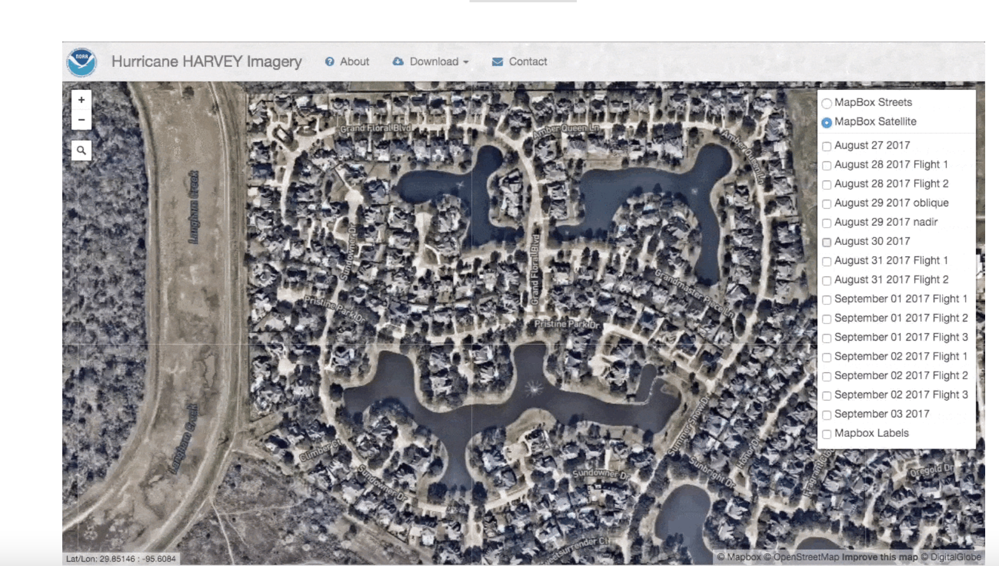
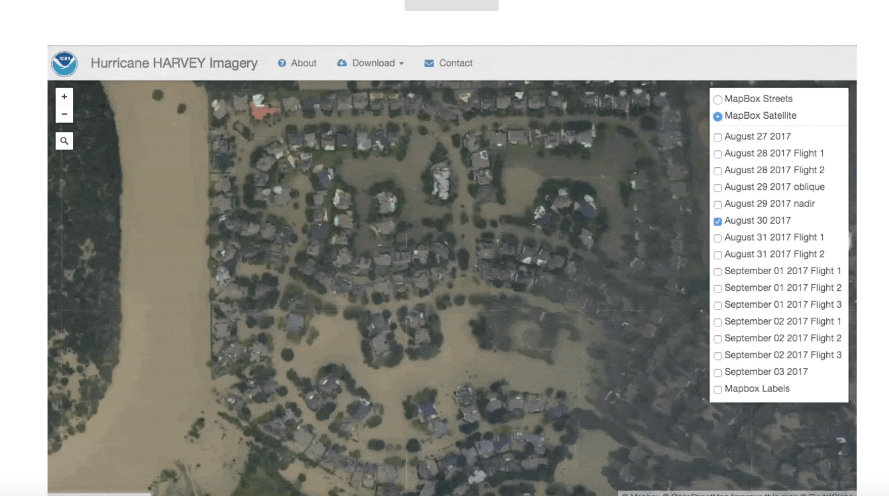

# Project 2 - Deforestation in the Amazon Rain Forest 

## Developer/Student Commentary: 
This Repository has been made to summit the project assignment for our Data Science Bootcamp at Northwestern University

PROJECT 2

June, 2021

This project was created by:

* Jorge Daniel Atuesta [Github Profile](https://github.com/danielatuesta55)
* Jhon Cass [Github Profile](https://github.com/cass-john)
* Jhon Strode [Github Profile](https://github.com/jdstrode)

## Chosen topic Amazon Rain Forest Deforestation!

Deforestation, one of humans kind worst attributes. By demolishing our rainforest, we are essentially creating our paths towards extinction. Christina Nunez (2019) mentions that between 1990 and 2016, the world lost 502,000 square miles (1.3 million square kilometers) of the forest. If you think about that number is equivalent to an area larger than South Africa. 

[Link to the National Geographic article by Christina Nunez]( https://www.nationalgeographic.com/environment/article/deforestation#:~:text=Between%201990%20and%202016%2C%20the,study%20in%20the%20journal%20Nature)

The link between deforestation and global warming has been proven over time by multiple studies, scientists, and activists; with that said, deforestation is still happening. For this particular project, we researched the world's biggest rainforest, The Amazon rainforest. Multiples countries share this forest, but the country that has the most land is Brazil. 

We looked into Brazil to see the history of deforestation and their ongoing attempts to stop it. WE gather data from the year 2004 till the year 2019; critical years in the war against deforestation. It was not until 2003 that the government started to regulate deforestation in the Amazon rainforest firmly. With new implementations came new challenges and the effect this had at the beginning was astonishing. As you can see on our graphs, deforestation went down, but it wasn't until 2008 and, more specifically, 2015 when illegal deforestation started to take a toll on the Amazon Rain forest. With the government possibly lowering their guard on this crucial aspect, multiple agencies saw this as a chance to take a piece of the forest for profit.

This project aims to showcase the efficiency of public policies if they are upheld and the need for deforestation to stop. Although we understand that this is one rain forest and one country, we know its impact on our ecosystem. 

With this said, we want to give a massive shoutout to everyone putting in the hours day after day to make this stop. We hear you, and we acknowledge you! 

## Data sets
Here are the links to the data sets used for this project:

Deforestation Data set: [Click Here](https://www.kaggle.com/mbogernetto/brazilian-amazon-rainforest-degradation)

NOAA Website: https://coralreefwatch.noaa.gov/crtr/data_resources.php

## Important Notice

Strart by downloading this into your enviroment 
`<pip intstall pandas>`
`<pip intstall flask>`
`<pip intstall flask_mongoengine>`
`<pip intstall flask_pymongo>`
`<pip intstall numpy>`

Since you need to deploy a Flask app it is really important that you run your terminal in shell. To run a shell you will need to type the following in your terminal `<pipenv run python app.py>`

Click on the server seen in the terminal to access the webpage and enjoy! 

## Inspiration for our data visualizations

Here are some screen shots of diffrent maps that have a strong impact to visualize data.

1. 
2. 
3. 
4. 
